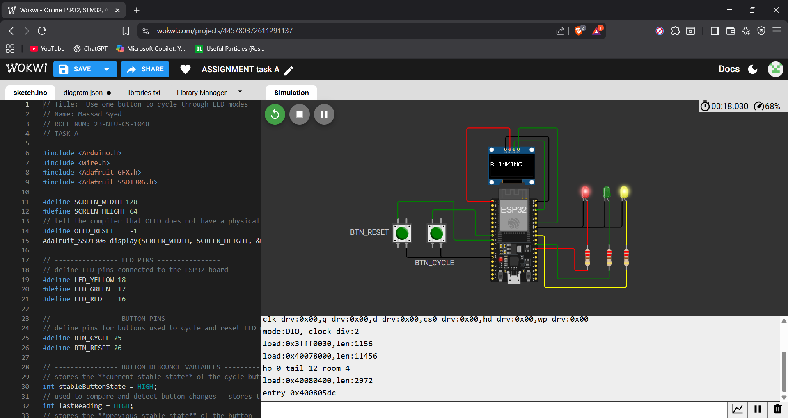

# LED Mode Cycling Project

This project uses an ESP32 with one button to cycle through LED modes and an OLED display.

## Wokwi Simulation
[View Project on Wokwi](https://wokwi.com/projects/445780372611291137)

## Pin Map
- **LED_YELLOW:** GPIO 18  
- **LED_GREEN:** GPIO 17  
- **LED_RED:** GPIO 16  
- **Button Cycle:** GPIO 25  
- **Button Reset:** GPIO 26  
- **OLED:** I2C (SDA/SCL)

## Screenshots
Include screenshots from your `screenshots/` folder here:

  

  

  

