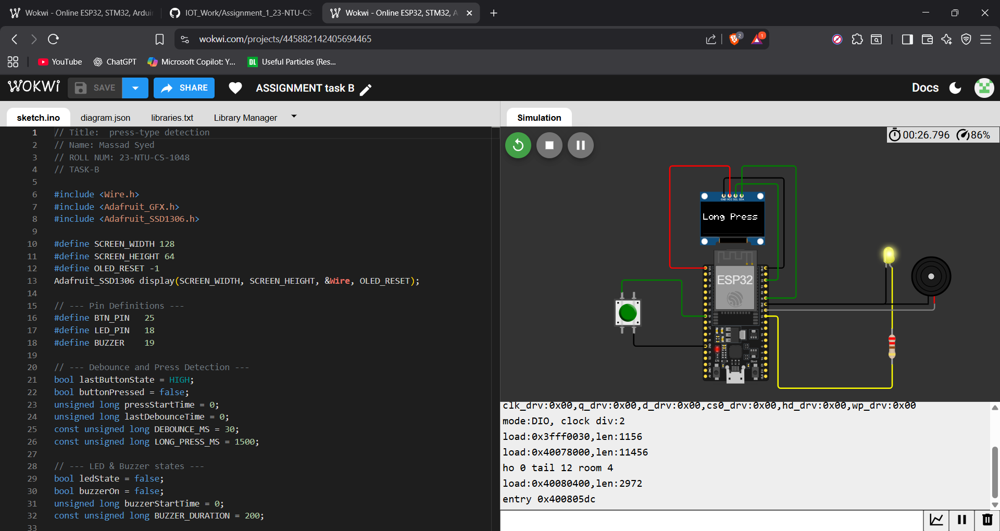
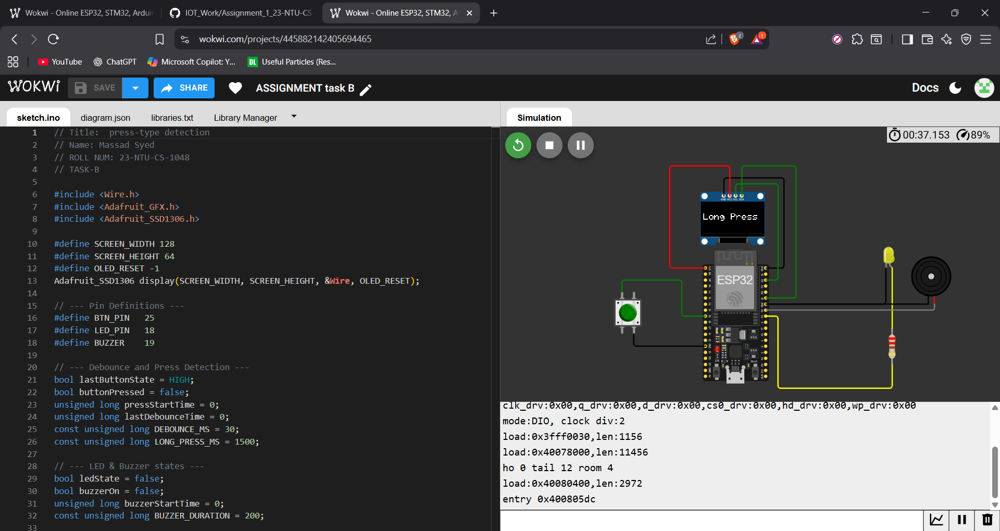

# Press Type Detection (ESP32)

This project detects **short and long button presses** on an ESP32, toggles an LED with a short press, and activates a buzzer on a long press. It also displays the status on an OLED screen.

---

## Wokwi Simulation

[View the simulation in Wokwi](https://wokwi.com/projects/445882142405694465)

---

## Pin Map

| Component   | Pin        | Description               |
|------------|-----------|---------------------------|
| Button     | GPIO 25   | Input button (pull-up)    |
| LED        | GPIO 18   | PWM output LED            |
| Buzzer     | GPIO 19   | Buzzer output             |
| OLED SDA   | GPIO 21   | I2C data                  |
| OLED SCL   | GPIO 22   | I2C clock                 |

---

## Screenshots

  

  

 

---

## Features

- Short press: Toggle LED  
- Long press (≥1.5s): Activate buzzer  
- OLED display shows "LED ON", "LED OFF", or "Long Press"  

---

## Usage

1. Connect the ESP32 according to the pin map.  
2. Upload the code to the ESP32 using Arduino IDE.  
3. Press the button to see LED and buzzer responses on the OLED.
